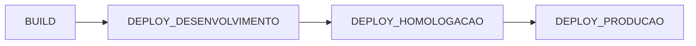

# Projeto - APPNAME

Orientações gerais de como configurar, executar, testar e realizar o deploy deste projeto.

# Visão Geral

## Tecnologias Utilizadas

- **Backend**

  - Java - v.17
  - Spring Boot - v.3.0.6
  - Jakarta Persistence - v.3.1.0
  - Hibernate - v.6.1.7.Final
  - Flyway - v.9.5.1
  - Lombok - v.1.18.26
  - Map Struct - v.1.5.3.Final
  - **Testes**
    - JUnit - v.5.9.2 (Jupiter)

- **Frontend**

  - Angular - v.15
  - PrimeNG - v.15  
  - RxJS - v.7.8
  - HTML - v.5
  - SASS / CSS
  - Javascript / TypeScript - ES2022
  - **Testes**
    - Karma - v.6.4
  - **UI Design** 
    - PrimeFlex - v.15   
    - Font Awesome - v.6.4
  - **Formatação e Análise Estática** 
    - Prettier - v.2.8.3
    - Eslint - v.8.31.0

- **Banco de Dados**
  - Postgres - v.42.6.0 (Driver Version)

- **Autenticação e Autorização**

  - JWT / OAuth2
  - Keycloak - v.16.1.0

- **Dependências e Empacotamento**

  - Maven - v.3.9.1
  - NPM - v.9.5.1

- **Execução**

  - Tomcat - v.10.1.8
  - Node - v.18.16 (Localmente)
  - Apache - v.2.4

- **Deploy**

  - Docker
  - Kubernetes
  - Gitlab CI/CD

## Pré-Requisitos para Ambiente Desenvolvimento

- Maven v3.9 ou superior
- Java Development Kit 17
- Node v18
- NPM v9
- Angular CLI v15
- Docker + Compose
- VSCode
- STS - Spring Tool Suite
  - O Lombok deve estar configurado

## Composição do Projeto

Este é um projeto multi-módulo contendo 3 módulos:

- **Parent (AppName)**
  - Módulo raiz do projeto. Nele, temos as pastas dos demais módulos e algumas outras estruturas do projeto como arquivos de configuração, pasta k8s e etc
- **Backend (AppName-API)**
  - Módulo que contém o backend do projeto estruturado com base num modelo arquitetural de camadas. Nesse módulo, todas as funcionalidades de negócio são expostas por meio de uma API REST documentada com o Swagger.
- **Frontend (AppName-UI)**
  - Módulo que contém toda a lógica da camada de apresentação do projeto.

Além desses módulo, o projeto gerado já traz consigo algumas dependências importantes, tais como:

- **trt8-core.jar**
  - Biblioteca contendo implementação padrão de diversas funcionalidades e configurações a ser utilizada em todos os nossos projetos.
- **trt8-parent.jar**
  - Define a configuração padrão dos principais plugins utilizados no projeto, versão das principais tecnologias (Spring Boot, Java e etc), além de definir outras configurações estruturais.
- **trt8-dependencies.jar**
  - Responsável por definir a versão padrão das principais bibliotecas utilizadas no projeto.
- **integracao-keycloak-client.jar**
  - Biblioteca contendo uma implementação de client do microsserviço de integração com Keycloak.
- **integracao-sigep-client.jar**
  - Biblioteca contendo uma implementação de client do microsserviço de integração com SIGEP.

# Configurações e Passos Iniciais do Projeto

## 1. Crie o Repositório do Projeto no Gitlab

Nesse passo, crie um projeto vazio no gitlab, siga as instruções contidas no próprio gitlab para para apontar o projeto criado para este repositório e defina as seguintes branches:

- **main**
- **develop**

Em seguida, realize o push da versão inicial do projeto na develop.

## 2. Importe as Configurações dos Clients do Sistema no Keycloak

Na pasta **keycloak/import** você encontrará os arquivos **appname-ui.json**, este arquivo deve ser importado nos realms de [DESENVOLVIMENTO](https://keycloak-hom.trt8.jus.br/auth/admin/TRT8_DEV/console/), [HOMOLOGAÇÃO](https://keycloak-hom.trt8.jus.br/auth/admin/TRT8_HOM/console/) e [STAGING](https://keycloak-prod.trt8.jus.br/auth/admin/TRT8_STAGING/console/) do Keycloak.

Sendo que para acessar o realm de DESENVOLVIMENTO, deverá ser utilizado o **login de rede** mais a _senha padrão_ **Tribunal_2020**

## 3. Crie os Perfis do Sistema no Client API do Sistema

Para cada realm citado acima, acesse o console administrativo e crie todos os perfis do sistema listados logo abaixo em _Clients > appname-api > Roles > Add Role_

Perfis do Sistema:

- **ADMIN**

## 4. Configure os Environments e as Variáveis do Pipeline CI/CD no Gitlab

Acesse o repositório do Projeto, no menu lateral, clique em _Deployments > Environments > New environment_ para criar criar os seguintes environments:

- **desenvolvimento**
- **homologacao**
- **producao**

A seguir, crie as variáveis do Pipeline CI/CD em _Settings > CI/CD > Variables > Expand > Add variable_ conforme a tabela abaixo:

| KEY                      | VALUE                                                                              |        ENVIRONMENTS        |
| ------------------------ | :--------------------------------------------------------------------------------- | :------------------------: |
| KEYCLOAK_RESOURCE_API    | appname-api                                                                |            All             |
| KEYCLOAK_RESOURCE_UI     | appname-ui                                                                 |            All             |
| MAIL_HOST                | URL do Serviço de E-mail                                                           |            All             |
| MAIL_PORT                | Porta do Serviço de E-mail informado entre aspas duplas                            |            All             |
| LOGGING_LEVEL            | Nível de log. Ex: info, debug, error, warn, trace                                  | Específico por Environment |
| JPA_SHOW_SQL             | "true" ou "false" para exibir ou não no console as queries executadas pelo sistema | Específico por Environment |
| KEYCLOAK_REALM           | Realm do Keycloak                                                                  | Específico por Environment |
| KEYCLOAK_AUTH_SERVER_URL | URL da instância do Keycloak a ser utilizada                                       | Específico por Environment |
| INTEGRACOES_KEYCLOAK_URL | URL do microsserviços de integração com o Keycloak                                 | Específico por Environment |
| INTEGRACOES_SIGEP_URL    | URL do microsserviços de integração com o SIGEP                                    | Específico por Environment |
| DB_URL                   | URL do banco de dados                                                              | Específico por Environment |
| DB_USERNAME              | Usuário para conexão com o banco de dados                                          | Específico por Environment |
| DB_PASSWORD              | Password do usuário utilizado para conexão com o banco de dados                    | Específico por Environment |

## 5. Configure os domínios DNS do projeto para cada um dos ambientes

Nesse passo, basta abrir um chamado na [Central de Serviço](https://centraldeservicos.trt8.jus.br/) para configurar um DNS para cada um dos ambientes do projeto. Recomenda-se configurar inicialmente somente os DNS de Desenvolvimento e Homologação, pois alterações no nome do projeto podem ocorrer e consequentemente, mudanças em seus domínios.

Exemplo de texto para o chamado de Configuração de DNS Interno:

> Prezados, solicito que sejam configurados os seguintes DNS e que sejam disponibilizados para acesso interno (CNAME).
>
> - appname-dev.trt8.jus.br -> 10.8.26.106
> - appname-hom.trt8.jus.br -> 10.8.26.106
>
> Grato.

## 6. Crie o usuário e o schema do Banco de Dados para cada um dos ambientes

Nesse passo, basta abrir um chamado na [Central de Serviço](https://centraldeservicos.trt8.jus.br/) para Criação de Banco de Dados para cada um dos ambientes do projeto. Recomenda-se configurar inicialmente somente para os ambientes de Desenvolvimento e Homologação, pois alterações no nome do projeto podem ocorrer e consequentemente, mudanças no schema ou usuário do banco de dados.

Exemplo de texto para o chamado de Criação de Banco de Dados:

> Prezados, precisamos que sejam disponibilizados novos schemas.
>
> - Schema: APPNAME
> - Databases: DESDB e HOMDB
> - Host: oracle-apoio.trt8.net
> - Port: 1521
>
> As estruturas serão criadas a partir da aplicação.
>
> Grato.

## 7. Execute o Pipeline do Projeto e Disponibilize a Versão Inicial do Projeto em Desenvolvimento

Após todos os passos anteriores terem sido concluídos, já é possível realizar o deploy da aplicação em desenvolvimento. Para tanto, basta ir no repositório do projeto no Gitlab e **criar uma nova tag** a partir da branch **develop**, em _Repository > Tags > New tag_ (Ex: **Tag name**: 1.0.0-rc-1, **Create from**: develop).

Após a criação da tag, o pipeline será iniciado e poderá ser acompanhado em CI/CD > Pipelines.

Atualmente, o pipeline desse projeto possui 4 estágios:

Somente o BUILD é realizado automaticamente após a criação da tag. Os demais devem ser acionados manualmente após a conclusão do BUILD.

Sendo assim, após a conclusão do BUILD do projeto, inicio o DEPLOY_DESENVOLVIMENTO para que o sistema seja disponibilizado em Desenvolvimento.

# Iniciando o Desenvolvimento

Caso você deseje realizar o desenvolvimento do projeto utilizando recursos locais, você precisa realizar os próximos passos, caso contrário pode pular para o último passo dessa lista.

## Executando o Keycloak e o Postgres Localmente

Para executar tanto o Keycloak quanto o Postgres locamente, basta executar o seguinte comando na raiz do projeto:

> docker compose up

Para que o comando acima funcione corretamente, o docker já deve estar em execução.

As imagens utilizadas serão baixadas e os containers serão inicializados. Durante a inicialização 2 scripts de inicialização serão executados, um para o Postgres () e outro para o Keycloak (). 

O script de inicialização do Postgres irá configurar 2 bancos de dados no Postgres, o _keycloak_ e o _localdb_. Sendo que o _keycloak_ será utilizado pela instância do Keycloak a ser executada localmente e o _localdb_, pela aplicação.

O script de inicialização do Keycloak irá importar o realm TRT8_DEV (_keycloak/import/realm.json_), importar o client da aplicação (_keycloak/import/**appname-ui.json**_) e sincronizar os usuário com o LDAP de Homologação do TRT8. Após sincronizados, qualquer usuário poderá ser utilizado para realizar o login no sistema utilizado o **login de rede** mais a _senha padrão_ **Tribunal_2020**.

Após a inicialização dos serviços ter sido concluída, para acessar o painel administrativo do Keycloak Local, acesse o link:

http://localhost:8280

Realize o login utilizando as seguintes credenciais:

> User: admin | Password: admin

Para que a aplicação possa utilizar este Keycloak devidamente, devemos realizar o **passo 3** de _"Configurações e Passos Iniciais do Projeto"_ para Configurar os Perfis do Sistema nessa instância local.

## Executando os Módulos do Projeto Localmente

Para maiores informações a respeito de como configurar e Executar cada módulo do projeto na IDE, abra o README.md de cada módulo do projeto e siga os passos especificados:

[appname-api](/appname-api/)

[appname-ui](/appname-ui/)
